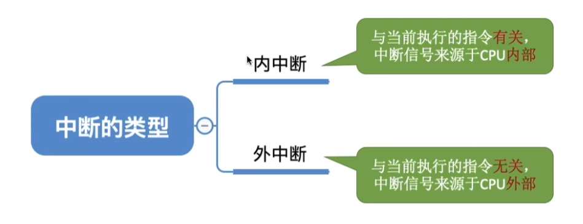
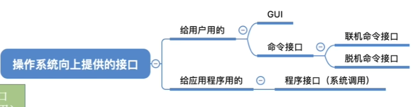
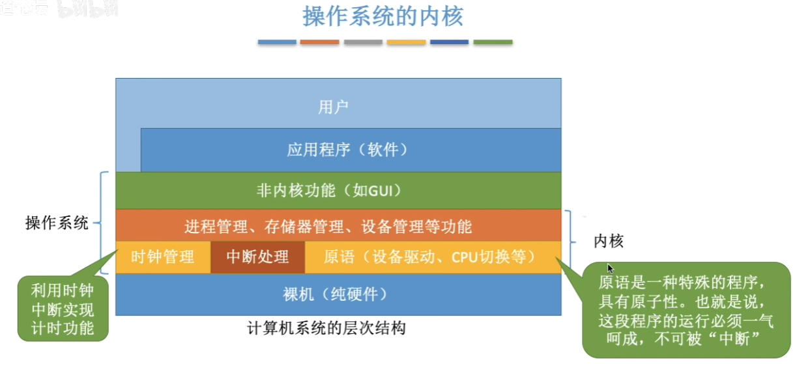

# 操作系统引论

## 一.操作系统的发展

没有操作系统的年代，计算机的操作尚且处于**手工操作阶段**。

这个过程是通过在纸带进行 **I/O操作**，且 计算机的运行效率 被 **I/O操作** 严重削弱。

### 常见的操作系统

单道批处理系统、多道批处理系统、分时系统、实时系统、微机操作系统、嵌入式操作系统、网络操作系统、分布式操作系统。

#### a.单道批处理系统

具有**自动性、顺序性、单道性**的特点。

**单道批处理系统**首次引入了 **脱机输入/输出技术**，并由 **监督程序** 负责控制作业的输入、输出。

**单道批处理系统** 中仅能有一道程序运行，只有该程序运行结束之后才能调入下一道程序。**CPU** 有大量的时间是在空闲等待 **I/O操作** 完成。资源利用率依然很低。

#### b.多道批处理系统

具有**无序性、调度性、多道性**的特点。

**操作系统**真正诞生，有了操作系统便实现了 **多道程序并发运行**，系统吞吐量增大。但 **人机交互** 尚未诞生。

#### c.分时操作系统

**分时操作系统** 引入了人机交互功能，计算机会以 **时间片** 为单位轮流为各个用户/作业服务，各个用户可通过 **终端** 与计算机进行交互。

但 **分时操作系统** 不能优先处理一些紧急任务，对各个用户/作业都是完全公平的。

#### d.实时操作系统

**实时操作系统**区别于**分时操作系统**，其可以优先响应一些紧急任务。**实时操作系统** 又分为 **硬实时操作系统** 和 **软实时操作系统**，其中前者要求时间绝对严格，后者允许偶尔违背时间规则。

## 二.操作系统的运行机制

操作系统的主要功能包括：**处理器管理/进程管理、存储管理/内存管理、设备管理、文件管理**。

### 1.程序

计算机内的程序分为**内核程序**与**应用程序**。

CPU 有专门记录运行状态的 **程序状态寄存器 (PSW, Program Status Word)**，用于区分不同的 **CPU** 状态。

**应用程序 **只能使用 “**非特权指令**” ，如：加法指令、减法指令等。

为了使 CPU 判断指令类型，其运行状态被分为了**内核态**和**用户态**。

处于**内核态**的 **CPU** 能执行**特权指令**。而**用户态**下则只能使用**非特权指令**。

如果 **CPU** 在用户态下检测到**特权指令**，则会引发**中断信号**，并停止运行当前的应用程序，转而运行**处理中断信号的内核程序**。

| 变化            | 诱因                            |
| --------------- | ------------------------------- |
| 内核态 → 用户态 | 特定特权指令——修改**PSW标志位** |
| 用户态 → 内核态 | 由**中断信号**引发              |

### 2.中断

在合适的情况下，操作系统内核会把 **CPU** 的使用权主动让给应用程序。
**中断** 是让 操作系统**内核** 夺回 **CPU使用权** 的唯一途径，使 **CPU** 从用户态转为内核态。

发生 **中断** 之后 **CPU** 一定会进行处理中断的**内核程序**。

经常性的，人们成内中断叫做**异常**，外中断叫做**中断**。

| 中断形式 | 内容                                    |
| -------- | --------------------------------------- |
| 内中断   | 陷阱、陷入、故障 (fault) 、终止 (abort) |
| 外中断   | 时钟中断、I/O 中断                      |

后续的**关中断**即屏蔽外中断，以此来保证关键程序的运行。

### 3.系统调用

**系统调用** 是操作系统提供给应用程序使用的**接口**，可以理解为一种**可供应用程序调用**的特殊函数，应用程序可以通过系统调用来请求获得操作系统内核的服务。

**系统调用**的过程中常常使用到**陷入指令**来使**CPU**进入**内核状态**。

### 4.操作系统体系结构

其中**原语**是一种特殊的程序，具有**原子性**。必须一气呵成，不可被“中断”

我们将**内核结构**分为**大内核**与**微内核**。

**微内核**只保留了操作系统中与硬件关系最紧密的部分。而**大内核**则在微内核的基础上加入了进程管理、存储器管理等内容。

**大内核**不需要多次进行 **CPU** 状态的转换，但是通常难以维护。

**BIOS：Basic Input / Output System**