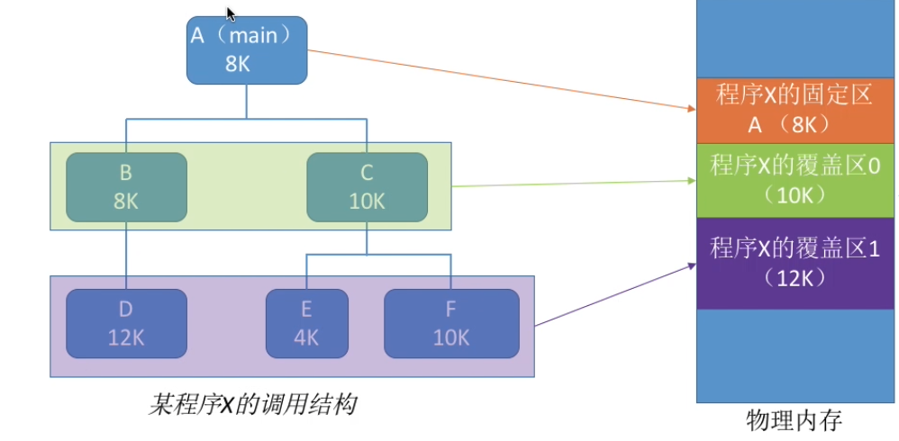
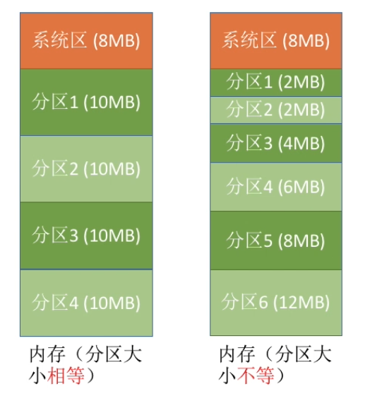
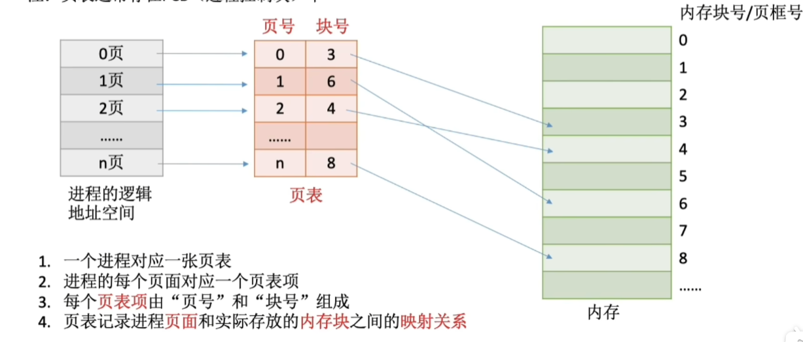
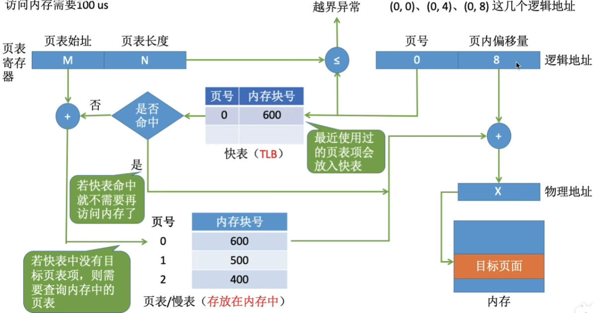
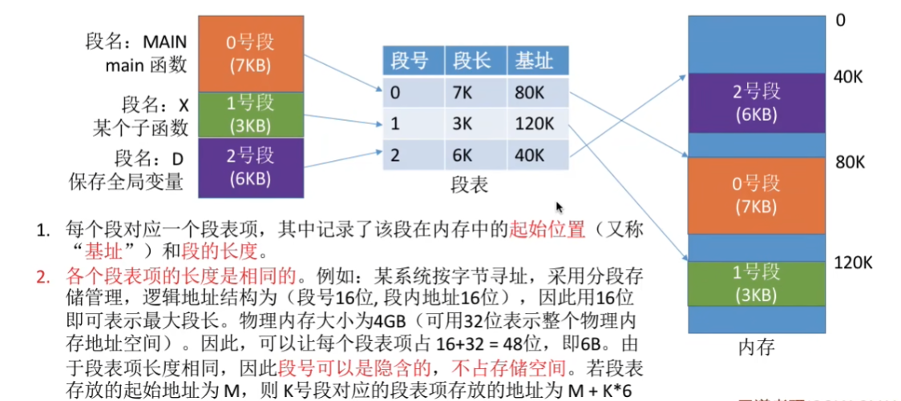
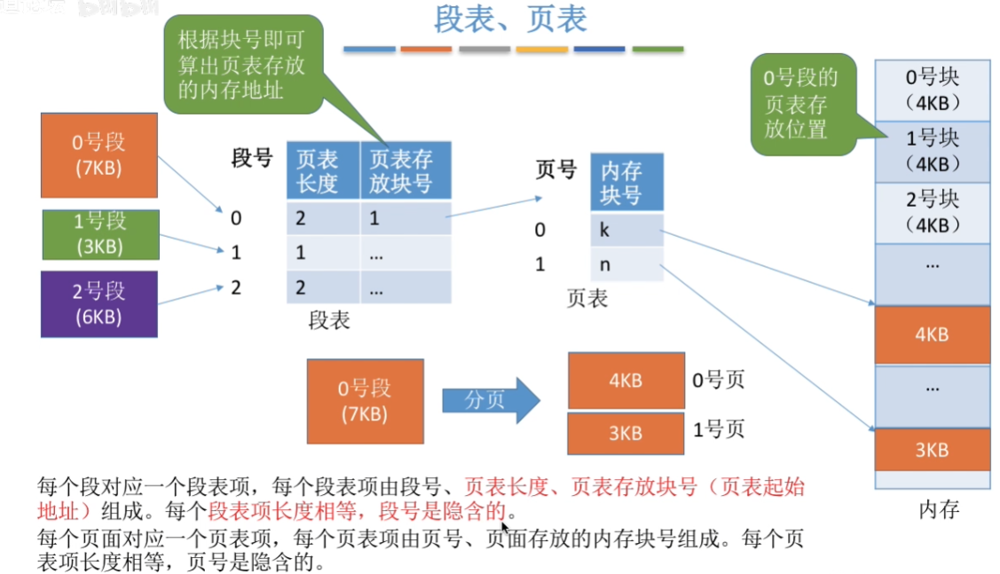
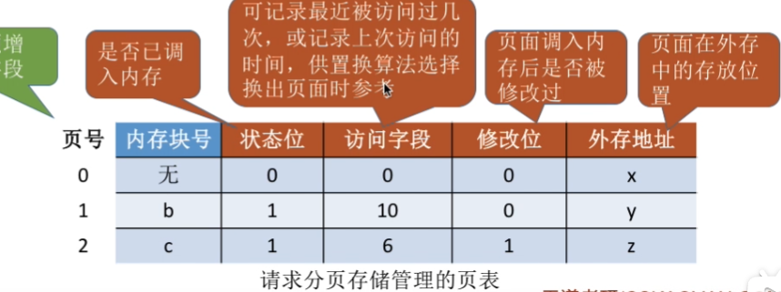
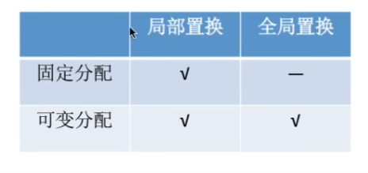

# 内存

## 一.内存管理

### 1.内存的概念

**内存**可存放数据。程序执行前需要先放到**内存**中才能被**CPU处理**，以此来缓和**CPU**与**硬盘**之间的速度矛盾。

将**逻辑地址**转化为**物理地址**的三种思路：

| 装入方法       | 装入时机                         |
| -------------- | -------------------------------- |
| 绝对装入       | 在编译时即转换                   |
| 可重定位装入   | 放入内存时根据实际地址来进行转换 |
| 动态重定位装入 | 程序执行时再进行转换             |

此外，操作系统对内存的管理主要要满足以下要求：

1. **操作系统**负责处理**内存空间的分配和回收**。
2. **操作系统**为需要提供某种技术从逻辑上**对内存空间进行扩充。**
3. **操作系统**需要提供地址转换功能，负责程序的**逻辑地址与物理地址的转换。**

### 2.内存保护

内存的保护可以通过以下方法来实现：

1. 方法一：在CPU中设置一对上、下限寄存器，存放进程的上、下限地址。进程的指令要访问某个地址时，CPU检查是否越界。
2. 方法二：采用**重定位寄存器 / 基址寄存器**和**界地址寄存器 / 限长寄存器** 进行越界检查。**重定位寄存器**中存放的是进程的**起始物理地址**。**界地址寄存器**中存放的是进程的**最大逻辑地址**。

## 二.内存空间的分配与回收

### 1.内存空间的扩充

#### a.覆盖技术

**覆盖技术**主要是将**不可能同时被访问的程序段**分配给同一内存块 (被称为**覆盖区**) 中。谁需要被执行就占用该覆盖区，以此来减少内存的占用。

#### b.交换技术

在内存空间紧张时，系统将内存中某些进程暂时换出外存 **(挂起)**，把外存中某些已具备运行条件的进程换入内存。

这个过程使用的便是**中级调度**。

现代操作系统通常将磁盘空间分为**文件区**与**对换区**。其中，**对换区** 的 I/O操作比**文件区**快。

### 2.分配方法

**连续分配**：为用户进程分配的必须是一个连续的内存空间。

**内部碎片**：分配给某进程的内存区域中，如果有些部分没有用上。
**外部碎片**：是指内存中的某些空闲分区由于太小而难以利用。

**紧凑**：将内存中的进程集中在相邻内存空间来释放外部碎片。

#### a.单一连续分配

内存被分为系统区与用户区，系统区位于内存的低地址部分，用于存放操作系统的数据。且内存中只能有一道用户程序。(适用于早期**单道批处理模式**)

#### b.固定分区分配

在引入多道批处理系统后，为了同时在内存装入多道程序，引入了**固定分区分配**。

固定分区分配将内存划分为大小固定的分区。

操作系统需要建立一个数据结构——**分区说明表**，来实现各个分区的分配和回收。

#### c.动态分区分配

动态内存分配是在进程被装入内存时，根据进程大小来动态的建立分区。

操作系统通过建立**空闲分区表**或**空闲分区链**来记录内存的使用情况。

### 3.动态分区分配算法

| 动态分区分配算法 | 内容                                                         |
| ---------------- | ------------------------------------------------------------ |
| 首次适应算法 FF  | 每次都从低地址开始查找，找到第一个能满足大小的空闲分区。     |
| 最佳适应算法 BF  | 空闲分区按**容量递增次序**排序。每次分配内存时顺序查找空闲分区表，找到大小能满足要求的第一个空闲分区。(小分区优先) |
| 最坏适应算法 WF  | 空闲分区按**容量递减次序**排序。每次分配内存时顺序查找空闲分区表，找到大小能满足要求的第一个空闲分区。(大分区优先) |
| 相邻适应算法 NF  | 思想同首次适应算法，但是将空闲分区组成一个循环链表，每次从上一次查询结束的位置开始查找。 |

## 三.分页存储

将内存空间分为一个个大小相等的分区，每个分区就是一个 **页框 / 页帧**。每个**页框**有一个编号，即 **页框号**，页框号从0开始。

为了与内存的**页框**匹配，进程会被划分为多个**页面**，大小与**页框**一致，二者是一一对应关系。

进程逻辑地址空间的每一个页面都会被**页号**独立标识，与之对应的是页框号，即**块号**。

进程的**页号**与内存的**块号**一一对应。

页号与地址存在隐形转换，因此不需要存储页号，只需要存储块号即可。

任意逻辑地址都可以被拆分为：**页号与页内偏移量**。
$$
页号=逻辑地址/页面长度
$$

$$
页内偏移量=逻辑地址 \% 页面长度
$$

### 1.基本地址变换机构

**基本地址变换机构**可以借助进程的页表将**逻辑地址**转换为**物理地址**。

其工作逻辑为：

将**逻辑地址**拆分为 **页号** 和 **页内偏移量**。查询**页表**，找到页号对应的**块号**，再将对应的**块号**与**页内偏移量**相加，得到**物理地址**。

理论上，**页表项长度**为 `3B` 即可表示内存块号的范围，但是，为了方便页表的查询常常会让一个页表项占更多的字节，使得每个页面恰好可以装得下整数个页表项。

### 2.具有快表的地址变换机构

**快表**，又称**(TLB,translation lookaside buffer)**，是一种访问速度比内存快很多的**高速缓存**(不是内存)，用来存放最近访问的页表项的副本，可以加速地址变换的速度。

与此对应，内存中的页表常称为慢表。

**快表的工作原理：**

每次查询时都先检查**快表**中是否存在，若未命中，则需要查询内存中的页表，并将查询结果放入快表中，并访问对应的内存单元；若命中，则直接访问对应内存单元。

**局部性原理：**

**局部性原理**主要分为**时间局部性**和**空间局部性**，其核心观点就是，之前经常被访问的资源在之后也很可能被经常访问；之前经常被访问的资源旁边的资源在之后也很可能被访问。

### 3.两级页表

**单级页表**存在两个问题：

1. 页表必须连续存放，因此当页表很大时，需要占用很多个连续的页框。
2. 没有必要让整个页表常驻内存，因为进程在一段时间内可能只需要访问某几个特定的页面

为此，我们可以将**单级页表**按页框进行分割，并记录每一个页框的地址，实现**两级页表**。

这其中，存放**单级页表**地址信息的第二层页表被称为 **顶级页表 / 外层页表**。

但这个过程需要进行**三次访存**，分别为：

- 访问一级页表来查询二级页表的信息
- 查询对应地址的页表来获取物理地址块
- 访问物理地址块对应的内存空间

### 4.分段存储

**分段存储**可以理解为是动态的划分分区。程序按照程序自身的逻辑关系划分为若干个段，每个段都有一个段名(在低级语言中，程序员使用段名来编程)，每段从0开始编址。

**段表**是用来记录分段情况的数据结构，其字段是 **段长** 和 **基址**。段号同样是可以隐含的。

其中，**分页**的用户进程地址空间是**一维**的，程序员只需给出一个记忆符即可表示一个地址。
**分段**的用户进程地址空间是**二维**的，程序员在标识一个地址时，既要给出段名，也要给出段内地址。

**分页**对用户不可见，而**分段**对用户可见。

**分段**比**分页**更易实现信息的保护和共享。

### 5.段页式存储

**段页式存储**主要利用了**分段存储**的共享保护优势和**分页存储**的离散优势。

其原理即：**先分段，再按分段的结果将不同的段进行分页处理。**

段页式的每个段都要开一个页表，以此记录每个段的分页情况。

**段页式存储**也是需要**三次访存**，分别是：

- 访问段表来查询段对应的页表的信息
- 查询对应段的页表来获取物理地址块
- 访问物理地址块对应的内存空间

## 四.虚拟存储

上述方法很难实现大作业的运行。由于内存空间有限，很多情况下我们无法将整个作业都放进内存中运行。

虚拟存储主要是以下两大步骤：

- 在程序执行过程中，当所访问的信息不在内存时，由操作系统负责将所需信息**从外存调入内存**，然后继续执行程序。
- 若内存空间不够，由操作系统负责**将内存中暂时用不到的信息换出到外存**。

虚拟内存的三大主要特征：**多次性，对换性，虚拟性**。

影响虚拟内存大小的关键因素：计算机系统的**寻址空间**，即**操作系统的字长**。

### 1.请求分页管理方式

**请求分页管理系统**便是采用了**虚拟存储技术**的分页存储。

**请求页表**是**请求分页管理方式**的修改版页表。

**缺页中断**是因为当前执行的指令想要访问的目标页面未调入内存而产生的，因此属于**内中断**。

### 2.页面置换算法

**`belady`现象**：当为进程分配的物理块数增大时，缺页次数不减反增的异常现象。

| 算法                                  | 内容                                                         | 特点                         |
| ------------------------------------- | ------------------------------------------------------------ | ---------------------------- |
| 最佳置换算法 OPT                      | 每次选择淘汰的页面将是以后**永不使用**，或者**在最长时间内不再被访问**的页面，这样可以保证最低的缺页率。 | 只是理想模型，不可实现       |
| 先进先出置换算法 FIFO                 | 先进的页面先被调出内存。                                     | 存在`belady`现象             |
| 最近最久未使用置换算法 LRU            | 每次淘汰的页面是最近最久未使用的页面                         | 实现困难，开销大             |
| 最不常使用置换算法 LFU                | 每次淘汰的页面是目前使用最少的页面                           | 开销大                       |
| 时钟置换算法 CLOCK / 最近未用算法 NRU | 如下所示                                                     | 被认为是性能和开销均衡的算法 |

**最近未用算法 NRU / 时钟置换算法 CLOCK** (下称**CLOCK算法** )，分为 **经典 CLOCK 算法** 和 **优化CLOCK算法**。

#### a.经典CLOCK算法

**经典CLOCK算法**要求 放入时状态位为1；每次淘汰时，如果状态位为 0 ，则换出；如果状态位为 1，则暂不换出，将其换为 0 后，检查剩余的状态位；

状态位为1表示最近访问过，为0则表示最近未被访问过。

#### b.优化CLOCK算法

**优化CLOCK算法**主要优化在：如果当前要被淘汰的页面根本就没被修改的话，不需要更改**外存**对应的数据，而是直接覆盖**内存**里的页面。

要实现这个，我们只需要再增加一位**修改位**即可。一个页面的修改位为 0 时，将其覆盖并修改为 1；为 1 时则调回外存并修改为 0  。

且在该算法中，修改位为 0 的页面会被优先换出。

以 **(访问位，修改位)** 为例，优先级为 **(0, 0) > (0, 1) > (1, 0) > (1, 1)**

实际算法比较复杂：

1. 第一轮:从当前位置开始扫描到第一个(0,0)的帧用于替换。本轮扫描不修改任何标志位
2. 第二轮:若第一轮扫描失败，则重新扫描，查找第一个(0,1)的帧用于替换。本轮将所有扫描过的帧访问位设为0
3. 第三轮:若第二轮扫描失败，则重新扫描，查找第一个(0,0)的帧用于替换。本轮扫描不修改任何标志位
4. 第四轮:若第三轮扫描失败，则重新扫描，查找第一个(0,1)的帧用于替换。

但整体思路是按**优先级**来的。

### 3.页面分配策略

**驻留集**：指请求分页存储管理中给单个进程分配的**物理块**的集合。一般**小于**进程实际的大小。

**工作集**：指在某段时间间隔里，进程实际访问页面的集合。通过**窗口尺寸**来进行推算。

| 分配方式 | 内容                                     |
| -------- | ---------------------------------------- |
| 固定分配 | 进程被分配的物理块大小不可改变           |
| 可变分配 | 进程被分配的物理块大小可根据情况做出改变 |

| 置换方式 | 内容                                                         |
| -------- | ------------------------------------------------------------ |
| 局部置换 | 发生缺页时只能选进程自己的物理块进行置换                     |
| 全局置换 | 操作系统可以将保留的空闲物理块或其他进程的物理块分配给缺页进程 |

因此有三种分配置换方法：

| 分配置换方法     | 特点                                             |
| ---------------- | ------------------------------------------------ |
| 固定分配局部置换 | 缺页即选出页面换出                               |
| 可变分配全局置换 | 缺页即增加物理块数量                             |
| 可变分配局部置换 | 若偶尔缺页则进行页面换出，频繁缺页则增加物理块。 |

### 4.抖动

**抖动 / 颠簸**，即刚刚换出的页面马上又要换入内存，刚刚换入的页面马上又要换出外存。

通常是物理块分配过少导致的。

为了找到合适的**物理块分配数量**，我们可以对**工作集**进行分析，找到最合适的**工作集**大小。

(**工作集**类似于对**窗口**内的页面进行`hash`去重)