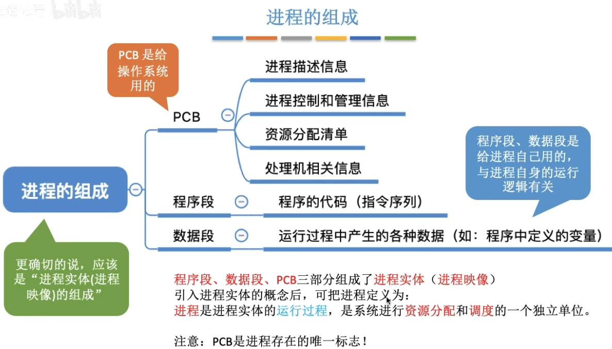
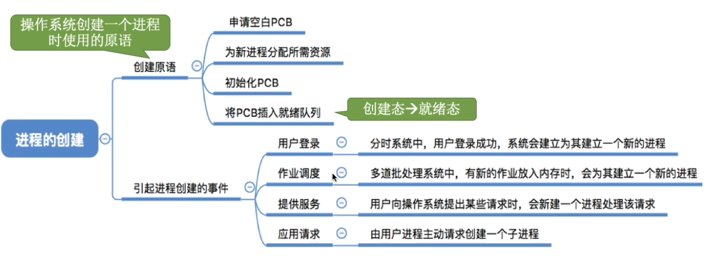
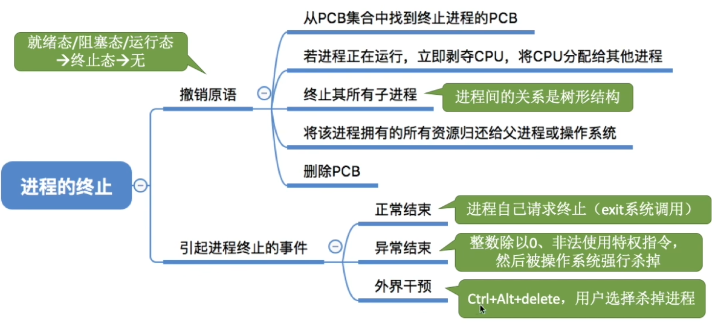
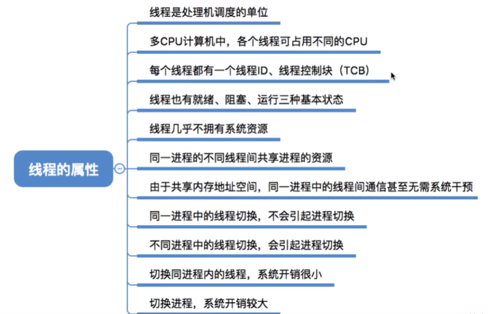
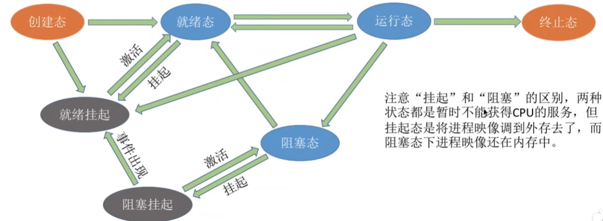
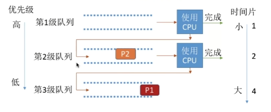
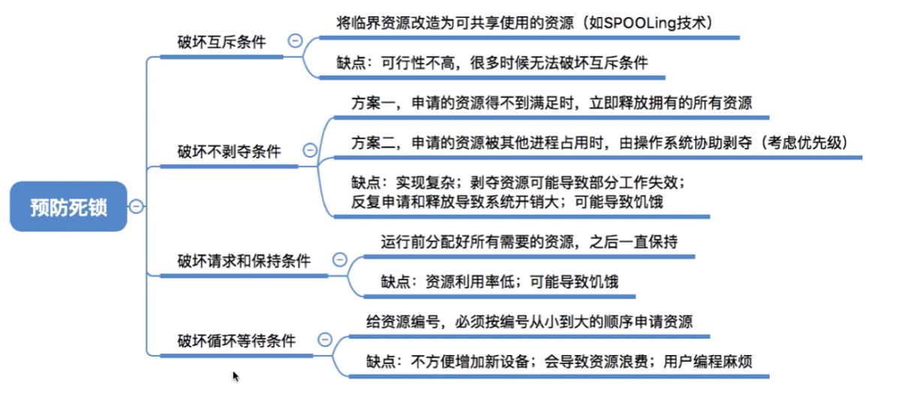
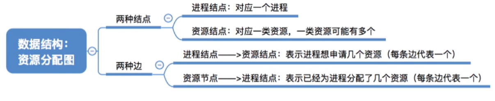

# 进程与调度

## 一.进程

### 1.概念、组成、特征

一句话，**进程是程序运行的实例**。

- **进程**是进程实体的运行过程，是系统进行**资源分配**和**调度**的一个**独立单位**。

- **进程**的5个特性：**动态性、并发性、独立性、异步性、结构性**

每个进程被创建时，都被分配了一个唯一的、不重复的 **PID**

所有关于进程的信息数据等都会被存入 **进程控制块 (PCB, Process Control Block)**。 

一个进程的实体，由 **PCB 、 程序段** 和 **数据段 **组成。



再次强调，进程的特性有：**动态性、并发性、独立性、异步性、结构性**。

### 2.进程的状态

进程的三种状态：**阻塞态、就绪态、运行态**。

注意：进程进入阻塞态需要用 **系统调用** 来申请对某些资源的访问，因此只可能由 **运行态** 转换为 **阻塞态**。因为只有在这个过程中其占有 **CPU**，可以进行 **系统调用**。

进程常见的组织方式：

| 组织方式 | 解释                                                         |
| -------- | ------------------------------------------------------------ |
| 链接方式 | 按照进程状态将PCB分为多个队列。操作系统持有指向各个队列的指针 |
| 索引方式 | 根据进程状态的不同，建立几张索引表。操作系统持有指向各个索引表的指针 |

### 3.进程控制

**进程控制** 的主要功能是对系统中的所有进程实施有效的管理，它具有**创建新进程、撤销已有进程、实现进程状态转换**等功能。

#### a.原语

**进程的控制**需要通过 **原语** 来实现。

原语的原子性是通过 **关中断指令** 与 **开中断指令** 实现的：

**关中断指令** 会使当前进程屏蔽一切外部中断指令，直至进程执行到**开中断指令**。





进程切换过程中，对应进程的 PCB 会存储当前进程的运行环境，如 **程序状态字寄存器 (PSW)** 、 **程序计数器 (PC)** 、 **指令寄存器 (IR)** 、 **通用寄存器** 等信息。

**原语** 所需要完成的三项任务：更新 **PCB** 中的信息，将 **PCB** 插入合适的队列，分配/回收资源。

### 4.进程间通信

#### a.共享存储

**进程间通讯**主要是通过在内存钟开辟一段**共享存储区**，允许两个进程都可以访问该存储区，以此来达到通信的目的。

各个进程对于共享存储区的访问应该是**互斥**的。

**共享存储**主要有两种形式：

基于**数据结构**的共享：比如共享空间里只能放一个长度为10的数组。这种共享方式速度慢、限制多，是一种低级通信方式。
基于**存储区**的共享：操作系统在内存中划出一块**共享存储区**，数据的形式、存放位置都由**通信进程**控制，而不是操作系统。这种共享方式速度很快，是一种高级通信方式。

#### b.消息传递

进程间的数据交换以格式化的 **消息(Message)** 为单位。进程通过操作系统提供的 **“发送消息/接收消息”** 两个原语进行数据交换。

#### c.管道通信

**管道通信**中管道是**半双工**的，且要求**先进先出**，先被写入管道的数据一定被先读取。

## 二.线程

### 1.线程的概念

**线程**是一个基本的**CPU**执行单元，也是程序执行流的最小单位。

引入线程后，**进程**只作为**除 CPU 之外**的系统资源的分配单元。

这也就是说，**进程**仍然是系统资源分配的**基本单位**但不再是**CPU调度** 的基本单位了，而**线程**则成为了**调度**的基本单位。

每个线程都有其独有的 **线程控制块(TCB)**。



### 2.线程的实现方式

#### a.用户级进程

**用户级线程**的管理是交由**应用程序**进行管理，**操作系统**只负责**进程**的管理。

**优点：**用户级线程的切换在用户空间即可完成，不需要切换到核心态，线程管理的系统开销小，效率高
**缺点：**当一个用户级线程被阻塞后，整个进程都会被阻塞，并发度不高。多个线程不可在多核处理机上并行运行。

#### b.内核级线程

**内核级线程**即将线程的控制交由**操作系统**来控制。这个过程中，操作系统会为线程分配不同的 **TCB**。


**优点：**当一个线程被阻塞后，别的线程还可以继续执行，并发能力强。多线程可在多核处理机上并行执行。
**缺点：**一个用户进程会占用多个内核级线程线程切换由操作系统内核完成，需要切换到核心态，因此线程管理的成本高，开销大。

## 三.调度

### 1.调度的概念

**高级调度(作业调度)**：按一定的原则从**外存**的作业后备队列中挑选一个作业调入**内存**，并创建进每个作业只调入一次，调出一次。作业调入时会建立**PCB**，调出时才撤销**PCB**。

**低级调度(进程调度/处理机调度)**：按照某种策略从就绪队列中选取一个进程，将 **CPU** 分配给它。

**中级调度 (内存调度)：**内存不够时，可将某些进程的数据调出**外存**。等内存空闲或者进程需要运行时再重新调入内存。暂时调到外存等待的进程状态为**挂起状态**。而中级调度便是按照某种策略决定将哪个处于**挂起状态**的进程重新调入内存。

| 调度类型 | 方向               |
| -------- | ------------------ |
| 高级调度 | 外存 → 内存        |
| 低级调度 | 内存 → CPU         |
| 中级调度 | 外存 (挂起) → 内存 |

七状态模型：



### 2.进程调度的时机

进程申请调度的时机通常有一下情况：


其中，**临界区 ≠ 操作系统内核程序临界区**

其中根据操作系统能否强制要求进程调度与切换，将进程调度的方式分为了 **非剥夺调度方式** 与 **剥夺调度方式**。

**非剥夺调度方式** 只允许进程主动放弃 **CPU** ，而**剥夺调度方式**允许将 CPU 强制分配给 紧迫程度更高的进程。

**闲逛程序 / 空闲程序**是在 没有其他就绪进程时会交由 **CPU** 进行处理的能耗极低的进程，主要是为了防止 **CPU** 空闲。

### 3.调度算法的评价指标

$$
CPU 利用率 = 忙碌时间 / 总时间
$$

而**周转时间**则是从**作业被提交给系统**开始到**作业完成**为止的总时间。

此外还提出了**带权周转时间**：
$$
带权周转时间 = 作业周转时间 / 作业实际运行的时间
$$
其必然大于1。

### 4.常见的调度算法

饥饿：可能存在进程永远无法获得处理器资源。

响应比的定义：
$$
响应比 = (等待时间 + 要求服务时间) / 要求服务时间
$$


| 调度算法               | 介绍                                                         | 是否会饥饿 |
| ---------------------- | ------------------------------------------------------------ | ---------- |
| 先来先服务(FCFS)       | 按照作业/进程到达的先后顺序进行服务                          | 否         |
| 短作业优先 (SJF)       | 最短的作业/进程优先得到服务(所谓“最短”，是指要求服务时间最短) | 是         |
| 高响应比优先(HRRN)     | 在每次调度时先计算各个作业/进程的响应比，选择响应比最高的作业/进程为其服务 | 否         |
| 时间片轮转调度算法(RR) | 按照各进程到达就绪队列的顺序，轮流让各个进程执行一个时间片。时间片结束后，将进程重新放到就绪队列队尾重新排队。 | 否         |
| 优先级调度算法         | 调度时选择优先级最高的作业/进程                              | 是         |
| 多级反馈队列调度算法   | 在下方解释                                                   | 是         |
| 多级队列调度算法       | 将不同作用的作业分别放置于不同队列分别进行处理。             | 否         |

其中，**多级反馈队列调度算法**结合了 **FCFS、SJF、RR** 三种调度算法的优点，被认为是一种优秀的算法。



其算法原理为：

1. 设置**多级就绪队列**，各级队列优先级从高到低，时间片从小到大。
2. 新进程到达时先进入第1级队列，按**FCFS**原则排队等待被分配时间片，若用完时间片进程还未结束，则进程进入**下一级队列队尾**。如果此时已经是在最下级的队列，则重新放回该队列队尾。
3. 只有 **第k级** 队列为空时，才会为 **k+1级** 队头的进程分配时间片。

## 四.进程互斥

进程具有 **异步性** 的特征。**异步性** 是指，各并发执行的进程以各自独立的、不可预知的速度向前推进。

对**临界资源**的互斥访问，可以在逻辑上分为如下四个部分：

```c
do {
    entry section; // 进入区
    critical section;  // 临界区
    exit section;  // 退出区
    remainder   // 剩余区
} while (true)
```

进程互斥的**四个基本原则**：

1. **空闲让进**。临界区空闲时，可以允许一个请求进入临界区的进程立即进入临界区。
2. **忙则等待**。当已有进程进入临界区时，其他试图进入临界区的进程必须等待。
3. **有限等待**。对请求访问的进程，应保证能在有限时间内进入临界区(保证不会饥饿)。
4. **让权等待**。当进程不能进入临界区时，应立即释放处理机，防止进程忙等待。

### 1.进程互斥的软件实现

#### a.单标志法

两个进程在访问完**临界区**后会把使用临界区的权限转交给另一个进程。也就是说每个进程进入临界区的权限**只能被另一个进程赋予**。

- 代码实例：

```c
int turn = 0;

// P0 进程：
while (turn != 0);
critical section;
turn = 1;
remainder section;

// P1 进程：
while (turn != 1);
critical section;
turn = 0;
remainder section;
```

**单标志法**的主要问题是，违背了**空闲让进**的原则。

这是由于`turn`必须被先指定，之后才能进行互斥操作。

#### b.双标志先检测法

设置一个**布尔型数组**来标记各进程想进入临界区的意愿。每个进程在进入临界区之前先检查当前有没有别的进程想进入临界区。

- 代码实例：

```c
bool flag[2];
flag[0] = false;
flag[1] = false;

// P0 进程
while (flag[1]);
flag[0] = true;
critical section;
flag[0] = false;
remainder section;

// P1 进程
while (flag[0]);
flag[1] = true;
critical section;
flag[1] = false;
remainder section;
```

**双标志先检测法**解决了**单标志法**无法满足**空闲让进**的缺点，但其违背了**忙则等待**的原则。

这是由于该方法无法防止双方同时进入**临界区**。

#### c.双标志后检测法

**双标志后检测法**根据**前检测法**进行了更改，将**检测**放在**上锁**之后。

- 代码实例：

```c
bool flag[2];
flag[0] = false;
flag[1] = false;

// P0 进程
flag[0] = true;
while (flag[1]);
critical section;
flag[0] = false;
remainder section;

// P1 进程
flag[1] = true;
while (flag[0]);
critical section;
flag[1] = false;
remainder section;
```

这样虽然解决了**忙则等待**，但是同时违背了**空闲让进**和**优先等待**。

这是由于可能二者同时上锁，发生互相等待的情况，使得双方均无法进入**临界区**。

#### d.Peterson算法

结合**双标志法**与**单标志法**的优化算法。

- 代码实例：

```c
bool flag[2];
int turn = 0;
flag[0] = false;
flag[1] = false;

// P0 进程
flag[0] = true;
turn = 1;
while (flag[1] && turn != 1);
critical section;
flag[0] = false;
remainder section;

// P1 进程
flag[1] = true;
turn = 0;
while (flag[0] && turn != 0);
critical section;
flag[1] = false;
remainder section;
```

这种算法解决了前边算法出现的问题，但会导致忙等，违背了**让权等待**原则。

### 2.进程互斥的硬件实现

#### a.中断屏蔽方法

利用关中断来实现互斥。


由于**关中断**的是针对于**单个处理器**而言的，因此对于**多处理器计算机**，仍然无法满足**互斥访问**。

#### b.TSL指令

**TSL指令**，或称 **TestAndSet 指令**，通过硬件实现上锁。

- 代码实例：

```c
bool TestAndSet(bool &lock){
    bool old;
    old = *lock;
    *lock = true;
    return old;
}

// 进程：
while (TestAndSet(&lock));
critical section;
lock = false;
remainder section;
```

该过程通过被称为`TestAndSet`是由于，其会先检测`lock`的值，如果为`false`则进行，并将`lock`设置为`true`。若`lock`本身就为`true`则持续检测 (Test) 并设置 (Set) 。

该方法也同样违背了**让权等待**原则。

#### c.Swap指令

**`Swap`指令**，或被称为**`Exchange / XCHG`指令**，其代码实例如下：

```c
bool old = true;
while (old == true) Swap(lock, old);
critical section;
lock = false;
remainder section;
```

其实和`TSL`指令差别不大，也同样违背了**让权等待**原则。

## 五.信号量

**信号量**其实就是一个变量 (可以是一个整数，也可以是更复杂的记录型变量)，可以用一个**信号量**来表示系统中某种资源的数量。

其中，`P`即 `等待操作 (wait)` ，负责信号量的**检查与上锁**。而 `V` 则是 `信号操作 (signal)`，负责信号量的**释放**。

### 1.整型信号量

用一个**整数型**的变量作为**信号量**，用来表示系统中某种资源的数量。

```c
int S = 1;

void wait(int S){
    while (S <= 0);
    S --;
}

void signal(int S){
    S ++;
}
```

### 2.记录型信号量

**整型信号量**的缺陷是存在 **忙等** 问题，因此人们又提出了 **“记录型信号量”**，即用记录型数据结构表示的**信号量**。

- 定义**信号量**，其中`*L`为等待队列：

```c
typedef struct {
    int value;
    struct process *L;
} semaphore;
```

- **PV操作：**

```c
void wait(semaphore S) {
    S.value --;
    if (S.value < 0){
        block (S.L);
    }
}

void signal(semaphore S) {
    S.value ++;
    if(S.value <= 0){
        wakeup (S.L);
    }
}
```

其中，`block(S.L)` 指将进程从**运行态**转为**阻塞态**并放置在**等待队列**的队尾。`wakeup(S.L)`则是唤醒**等待队列**的一个进程，将其从**阻塞态**转为**就绪态**。

这其中，当**信号量**的值为负值时，其绝对值就是**当前正在等待的进程**的数量。

### 3.互斥与同步

#### a.互斥

设置互斥信号量`mutex = 1`，则：

```c
semaphore mutex = 1;

void P1(){
    ...
    P(mutex);
    critical section;
    V(mutex);
    ...
}

void P2(){
    ...
    P(mutex);
    critical section;
    V(mutex);
    ...
}
```

#### b.同步

设置同步信号量`S = 0`，则：

```c
semaphore S = 0;
void P1(){
    line 1;
    line 2;
    ...
    line n;
    V(S);
}

void P2(){
    P(S);
    line 1;
    line 2;
    ...
    line n;
}
```

注意，不要忘记`P`操作是**检测**与**上锁**两个步骤，因此其可以检测`V`操作是否进行，以此来达到同步的目的。

#### c.前驱

假定存在前驱关系：a -> c 的同时 b -> c

则设定同步信号量 a 与 b：

```c
semaphore a = 0;
semaphore b = 0;

void Pa(){
    lines;
    V(a);
}

void Pb(){
    lines;
    V(b);
}

void Pc(){
    P(a);
    P(b);
    lines;
}
```

## 六.常见同步问题

同步问题基本原则：要保持`mutex`操作尽可能短。

### 1.生产者-消费者问题

该问题主要要实现的同步与互斥操作：

1. 消费者需要在生产者完成生产后进行消费。**(同步)**
2. 消费者消费与生产者生产需要互斥。**(互斥)**

```c
semaphore mutex = 1;
semaphore empty = n;
semaphore full = 0;

void producer(){
    while (1){
        生产一个产品;
        P(empty);
        P(mutex);
        把产品放入缓冲区;
        V(mutex);
        V(full);
    }
}

void consumer(){
    while (1) {
        P(full);
        P(mutex);
        从缓冲区取出产品;
        V(mutex);
        V(empty);
        使用产品;
    }
}
```

此处`PV`操作不可以改变顺序。若使`P(empty)`或`P(full)`在`mutex`内部，则可能会发生死锁。

### 2.读者写者问题

**读者写者问题**与**生产者-消费者问题**的区别在于，前者的读取并不会消耗产品，因此不需要先后同步。

该问题主要要实现的同步与互斥操作：

1. 读者读取的过程中写者不能改写。**(互斥)**
2. 读者在已经与写者互斥的情况下可以直接进行读取。
3. 读者在更改`count`的过程中需要互斥。**(互斥)**
4. 不能在写者改写的过程中源源不断有读者进入，导致`count`值一直不为`1`，`rw`互斥锁无法被释放。**(互斥)**

```c
semaphore rw = 1; // 用于读者与写者间的互斥
int count = 0;	// 用于检查是否存在其他读者在读取
semaphore mutex = 1; // 用于读者操作间互斥
semaphore w = 1;  // 用于写者与读者的进入互斥，防止饥饿

void writer(){
    while (1) {
        P(w);
        P(rw);
        写文件;
        V(rw);
        V(w);
    }
}

void reader(){
    P(w);
    P(mutex);
    if(count == 0) P(rw);
    count ++;
    V(mutex);
    V(w);
    
    读文件;
    
    P(mutex);
    count --;
    if (count == 0) V(rw);
    V(mutex);
}
```

### 3.哲学家进餐问题

**哲学家问题**的解决方案：

①可以对哲学家进程施加一些限制条件，比如最多允许四个哲学家同时进餐。这样可以保证至少有一个哲学家是可以拿到左右两只筷子的。

②要求奇数号哲学家先拿左边的筷子，然后再拿右边的筷子，而偶数号哲学家刚好相反。用这种方法可以保证如果相邻的两个奇偶号哲学家都想吃饭，那么只会有其中一个可以拿起第一只筷子，另一个会直接阻塞。这就避免了占有一支后再等待另一只的情况。

③仅当一个哲学家左右两支筷子都可用时才允许他抓起筷子。

## 七.管程

**管程**的基本特征：

1. 局部于管程的数据只能被局部于管程的过程所访问。
2. 一个进程只有通过调用管程内的过程才能进入管程访问共享数据。
3. 每次仅允许一个进程在管程内执行某个内部过程。

## 八.死锁

### 1.概念

**死锁**的四大条件：

1. **互斥条件**：只有对必须互斥使用的资源的争抢才会导致死锁。
2. **不剥夺条件**：进程所获得的资源在未使用完之前，不能由其他进程强行夺走，只能主动释放。
3. **请求和保持条件**：进程已经保持了至少一个资源，但又提出了新的资源请求，而该资源又被其他进程占有，此时请求进程被阻塞，但又对自己已有的资源保持不放。
4. **循环等待条件**：存在一种进程资源的循环等待链，链中的每一个进程已获得的资源同时被下一个进程所请求。

**死锁**的三大处理策略：

1. **预防死锁**：破坏死锁的四个必要条件
2. **避免死锁**：避免系统进入不安全状态
3. **死锁的检测与解除**：允许死锁发生，系统负责检测出死锁并解除。

### 2.预防死锁

破坏四大条件的方案：

1. 破坏**互斥条件**：把只能互斥使用的资源改造为允许**共享使用**，则系统不会进入死锁状态。如建立请求队列，所有进程对资源的访问需要申请并按顺序进行。

2. 破坏**不剥夺条件**：当某个进程请求新的资源得不到满足时，它必须立即释放保持的所有资源，待以后需要时再重新申请。或根据优先级来剥夺其他进程的资源。

3. 破坏**请求与保持条件**：可以采用静态分配方法，即进程在运行前一次申请完它所需要的全部资源，在它的资源未满足前，不让它投入运行。一旦投入运行后，这些资源就一直归它所有，该进程就不会再请求别的任何资源。

4. 破坏**循环等待条件**：可采用顺序资源分配法。首先给系统中的资源编号，规定每个进程必须按编号递增的顺序请求资源同类资源 (即编号相同的资源) 一次申请完。总之就是**防止成环**。

   

### 3.避免死锁

**避免死锁**主要是通过判断安全序列来实现的。

**安全序列**，就是指如果系统按照这种序列分配资源，则每个进程都能顺利完成。只要能找出一个安全序列，系统就是**安全状态**。

**判断安全序列**主要用到**银行家算法**：

核心思想：在进程提出资源申请时，先预判此次分配是否会导致系统进入不安全状态。如果会进入不安全状态，就暂时不答应这次请求，让该进程先阻塞等待。

我们对资源进行向量表示，如现在需要三种资源，而这三种资源的空闲数量为`(10,5,7)`

| 进程 | 最大需求 | 已分配  | 最多还需要 |
| ---- | -------- | ------- | ---------- |
| P0   | (7,5,3)  | (0,1,0) | (7,4,3)    |
| P1   | (3,2,2)  | (2,0,0) | (1,2,2)    |
| P2   | (9,0,2)  | (3,0,2) | (6,0,0)    |
| P3   | (2,2,2)  | (2,1,1) | (0,1,1)    |
| P4   | (4,3,3)  | (0,0,2) | (4,3,1)    |

依次比较是否有满足需求的进程，一旦进程完成便将其资源回收。若能找到一种顺序，使得所有进程都能顺利运行，则称找到了安全队列，系统便为安全状态。

### 4.死锁的检测与解除

**死锁定理**：如果某时刻系统的资源分配图是不可完全简化的，那么此时系统死锁。



如果系统中剩余的可用资源数足够满足进程的需求，那么这个进程暂时是不会阻塞的，可以顺利地执行下去。如果这个进程执行结束了把资源归还系统，就可能使某些正在等待资源的进程被激活，并顺利地执行下去。

如果按上述过程分析，最终能消除所有边，就称这个图是 可完全简化的。此时一定没有发生死锁 (相当于能找到一个**安全序列**)

解除死锁的方法：

1. **资源剥夺法**：挂起(暂时放到外存上)某些死锁进程，并抢占它的资源，将这些资源分配给其他的死锁进程。但是应防止被挂起的进程长时间得不到资源而饥饿。
2. **撤销进程法(终止进程法)**：强制撤销部分、甚至全部死锁进程，并剥夺这些进程的资源。这种方式的优点是实现简单，但所付出的代价可能会很大。
3. **进程回退法**：让一个或多个死锁进程回退到足以避免死锁的地步。这就要求系统要记录进程的历史信息，设置还原点。