# I/O 与 磁盘

## 一.I/O设备

### 1.I/O 设备的概念

**I/O 设备**就是可以将数据输入到计算机，或者可以接收计算机输出数据的外部设备，属于计算机中的**硬件部件**。

**I/O 设备**通常被分类为：

- 人机交互类外部设备
- 存储设备
- 网络通信设备

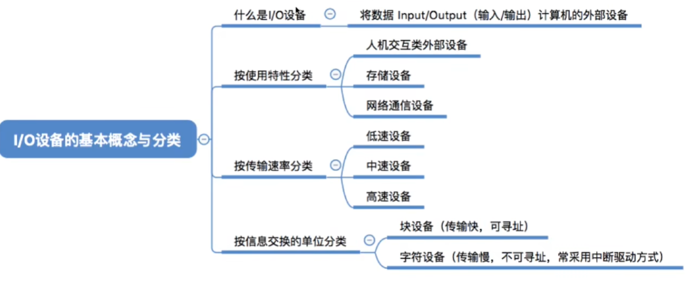

### 2.I/O控制器

**I/O设备**的**机械部件**主要用来执行具体I/O操作。如鼠标/键盘的按钮，显示器的LED屏。
**IO设备**的**电子部件**，即 **I/O控制器**，通常是一块插入主板扩充槽的**印刷电路板**。其实现了**CPU**对**I/O设备**的控制。

**I/O控制器** 负责：

- 接受和识别CPU发出的命令
- 向CPU报告设备的状态
- 数据交换
- 地址识别

对于 I/O设备的读入信息与状态信息，**I/O控制器**有专门的寄存器来进行存储，其存储方法有两种：**内存映像 I/O** 与 **寄存器独立编址**

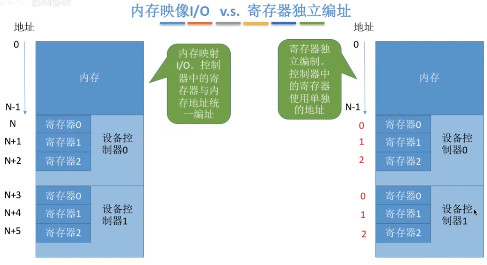

### 3.I/O控制方式

首先要区分三种寄存器：

数据寄存器：用于存储设备读入的数据。

控制寄存器：用于存储CPU发出的与I/O操作相关的命令

状态寄存器：用于存储I/O设备的状态，即是否准备好被读取。

| I/O控制方式      | 内容                                                         | 特点                                                         |
| ---------------- | ------------------------------------------------------------ | ------------------------------------------------------------ |
| 程序直接控制方式 | 持续检查状态寄存器的状态，若已准备好则读取数据寄存器的内容。 | CPU频繁的干预I/O操作，利用率低                               |
| 中断驱动方式     | 与**程序直接控制方法**相比，CPU不会持续检查状态寄存器，而是会挂起等待进程并处理其他进程。当I/O完成时向CPU发送中断信号，重新获得CPU。 | 每次I/O只处理一个字。频繁的切换CPU状态，开销大               |
| DMA方式          | 与**中断驱动方式**相比，数据传输的单位变为了**块**，数据**直接从设备流向内存**而无需经过CPU处理。只有开始和结束I/O时需要CPU处理。 | CPU一次请求只能处理一个或多个**连续**的数据块，而不能处理**离散**的数据 |
| 通道控制方式     | 通道是改进版的**DMA控制器**，其可以根据CPU预留的**通道指令**来进行操作。 | 真正实现了CPU与I/O设备的并行                                 |

**DMA方法**得益于硬件**DMA控制器**，使得I/O设备直接与内存对接，从而释放CPU，提高了效率。**DMA控制器**是依照CPU用于处理**I/O操作**的功能单独开出来的一个专门硬件。

**管道** 均是**处理机**，即是专用于**I/O操作**的 **CPU**。而 **DMA** 是 **管道** 的执行单元，其本身不是**处理机**。

### 4.I/O软件层次结构

**I/O软件层次结构**通常为：

**(从上到下)**

- 用户层软件
- 设备独立性软件      ────┐
- 设备驱动程序       ─────┼─── **操作系统**负责的 **I/O系统**
- 中断处理程序       ─────┘
- 硬件

| 层次           | 作用                                                         |
| -------------- | ------------------------------------------------------------ |
| 用户层软件     | 实现了与用户交互的接口，用户可直接使用该层提供的、与**I/O操作**相关的库函数对设备进行操作 |
| 设备独立性软件 | 与设备的硬件特性无关的功能几乎都在这一层实现。如读写、设备的保护、差错处理、设备的分配与回收。 |
| 设备驱动程序   | 主要负责对硬件设备的具体控制，将上层发出的一系列指令转化成设备可识别指令的一系列操作。包括设置设备寄存器、检查设备状态等。 |
| 中断处理程序   | 用于处理中断信号。                                           |

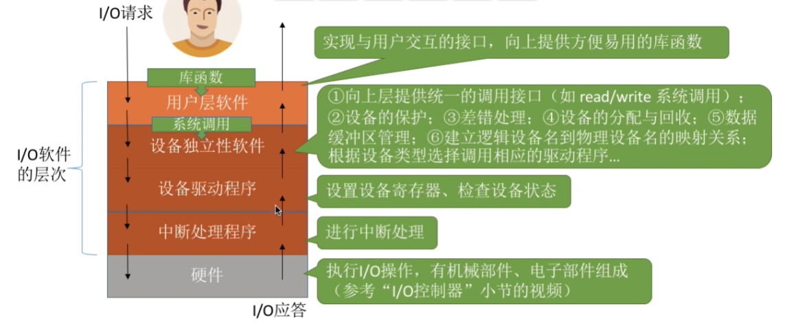

### 5.I/O应用程序接口

为了区分不同的设备，如**I/O应用程序接口**被分为了三大类：

- 字符设备接口
- 块设备接口
- 网络设备接口

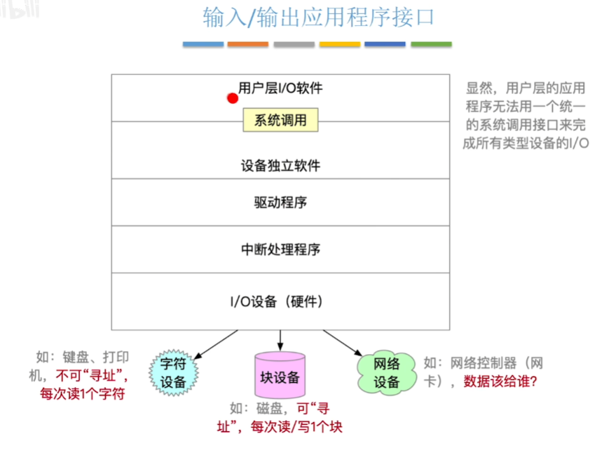

这其中，**网络设备接口**，又称 **网络套接字 / Socket 接口**，用于实现网络设备I/O。在调用时需要指明网络协议、端口等内容。

**阻塞 I/O**：应用程序发出 I/O 系统调用，进程需要转**阻塞态**等待。如：从键盘中读取一个字符。

**非阻塞 I/O**：应用程序发出 I/O 系统调用，系统调用可迅速返回，进程无需阻塞等待。如：向磁盘中写命令。

**驱动程序**需要向上层**设备独立软件**提供统一标准的**设备驱动程序接口**。

## 二.I/O核心子系统

### 1.假脱机技术

**脱机技术**：脱离主机的控制进行输入输出操作。

**假脱机 (SPOOLing) 技术**：使用软件的方式来模拟脱机技术。

**假脱机技术**的原理就是增加了一个输入/输出的缓冲区，以此来匹配磁盘读入读出速度。

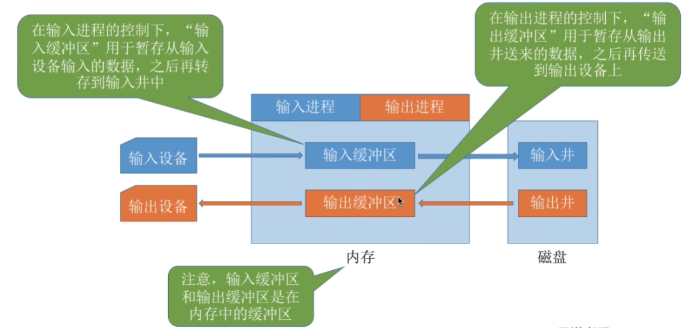

### 2.设备的分配与回收

- **设备分配**出于安全性考虑，通常有两种方式：

**安全分配方式**：为进程分配一个设备后就将进程阻塞，本次I/O完成后才将进程唤醒。

**不安全分配方式**：进程发出I/O请求后，系统为其分配I/O设备，进程可继续执行，之后还可以发出新的I/O请求。只有某个I/O请求得不到满足时才将进程阻塞。

- 出于静态与动态的考虑，则通常由两种方式：

**静态分配**：进程运行前为其分配全部所需资源，运行结束后归还资源。
**动态分配**：进程运行过程中动态申请设备资源。

**逻辑单元表 (LUT)**：用于实现设备的**逻辑名**到**物理名**的映射的数据结构。

**设备控制表 (DCT)**:系统为每个设备配置一张**DCT**，用于记录设备情况。

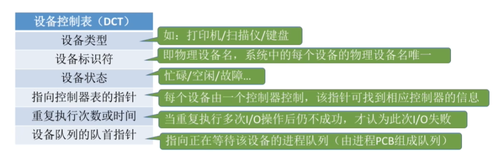

**控制器控制表(COCT)**：每个设备控制器都会对应一张**COCT**。操作系统根据**COCT**的信息对控制器进行操作和管理。

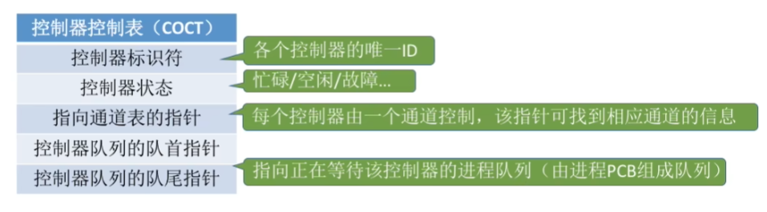

**通道控制表 (CHCT)**:每个通道都会对应一张**CHCT**。操作系统根据**CHCT**的信息对通道进行操作和管理。

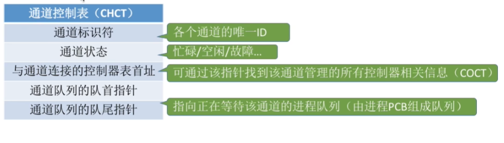

**系统设备表(SDT)**：记录了系统中全部设备的情况，每个设备对应一个表目

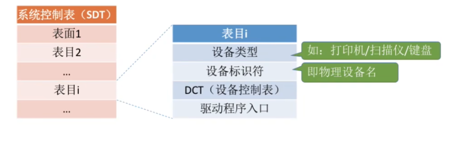

则设备分配的步骤为：

①根据进程请求的物理设备名查找**SDT** (注:物理设备名是进程请求分配设备时提供的参数)。
②根据**SDT**找到**DCT**，若设备忙碌则将进程**PCB**挂到设备等待队列中，不忙碌则将设备分配给进程。
③根据**DCT**找到**COCT**，若控制器忙碌则将进程**PCB**挂到控制器等待队列中，不忙碌则将控制器分配给进程。
④)根据**COCT**找到**CHCT**，若通道忙碌则将进程**PCB**挂到通道等待队列中，不忙碌则将通道分配给进程。

### 3.缓冲区

引入**缓冲区**的原因：

(1)缓和CPU与IO设备间速度不匹配的矛盾。

(2)减少对 CPU的中断频率，放宽对 CPU 中断响应时间的限制。

(3)解决数据粒度不匹配的问题。

(4)提高CPU和 I/O设备之间的并行性。

| 缓冲方式   | 内容                                                         |
| ---------- | ------------------------------------------------------------ |
| 单缓冲     | 操作系统会在主存中为其分配一个**缓冲区**。缓冲区的大小通常是一块 |
| 双缓冲     | 比单缓冲多一个缓存，内存中被分配了两个**缓冲区**             |
| 循环缓冲区 | 将多个大小相等的缓冲区链接成一个**循环队列**                 |
| 缓冲池     | 缓冲池由系统中共用的缓冲区组成。这些缓冲区按使用状况可以分为:空缓冲队列、输入队列、输出队列。 |

循环缓冲区：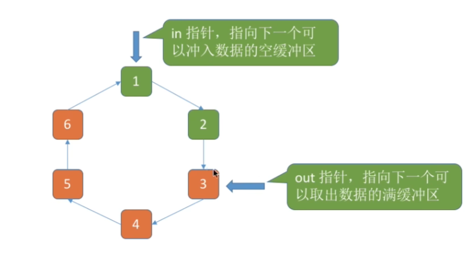

## 三.磁盘

**磁盘**：磁盘的表面由一些磁性物质组成，可以用这些磁性物质来记录二进制数据。

**磁盘的**盘面被划分为一圈一圈的**磁道**，每个**磁道**又会被划分成一个个**扇区**，被称为 **磁盘块**。

要完成磁盘的读写：

①根据“柱面号”移动磁臂，让磁头指向指定柱面;
②激活指定盘面对应的磁头;
③磁盘旋转的过程中，指定的扇区会从磁头下面划过，这样就完成了对指定扇区的读/写。

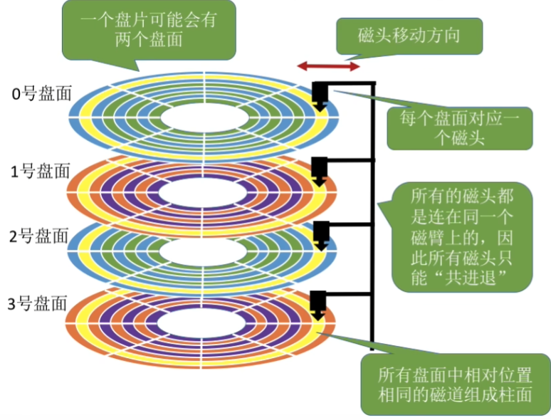

我们可以通过 **柱面号、盘面号、扇区号** 来独立的确认一个磁盘块。
磁头可以移动的磁盘称为**活动头磁盘**。

### 1.磁盘调度算法

**寻找时间(寻道时间)**：在读/写数据前，将磁头移动到指定磁道所花的时间。

**延迟时间**：通过旋转磁盘，使磁头定位到目标扇区所需要的时间。

**传输时间**：从磁盘读出或向磁盘写入数据所经历的时间。

| 磁盘调度算法          | 内容                                                         |
| --------------------- | ------------------------------------------------------------ |
| 先来先服务算法 FCFS   | 根据访问请求的先后顺序进行访问                               |
| 最短寻找时间优先 SSTF | 优先处理的磁道是与当前磁头最近的磁道。                       |
| 扫描算法 SCAN         | 只有磁头移动到最外侧磁道的时候才能往内移动，移动到最内侧磁道的时候才能往外移动。 |
| LOOK 调度算法         | 如果磁头移动方向上已经没有别的请求，就可以立即改变磁头移动方向。 |
| 循环扫描算法 C-SCAN   | 只有磁头朝某个特定方向移动时才处理磁道访问请求，而返回时直接快速移动至起始端而不处理任何请求。 |
| C-LOOK 算法           | 如果磁头移动的方向上已经没有磁道访问请求了，就可以立即让磁头返回，并且磁头只需要返回到有磁道访问请求的位置即可。 |

### 2.减少延迟时间

由于磁头读入一定数据后需要休整，一般一次读取无法完整读取一整个柱面。

磁盘的物理地址为 **(柱面号，盘面号，扇区号)**，这是由于，磁头相对于盘面的移动是统一的，通过**柱面号**寻址效率更高。

#### a.交替编号

若采用交替编号的策略，即让逻辑上相邻的扇区在物理上有一定的间隔，可以使读取连续的逻辑扇区所需要的延迟时间更小。

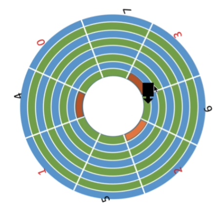

#### b.错位命名

通过将不同盘面的柱面进行不同编号的匹配，来减少休整时间对磁盘读写的影响。

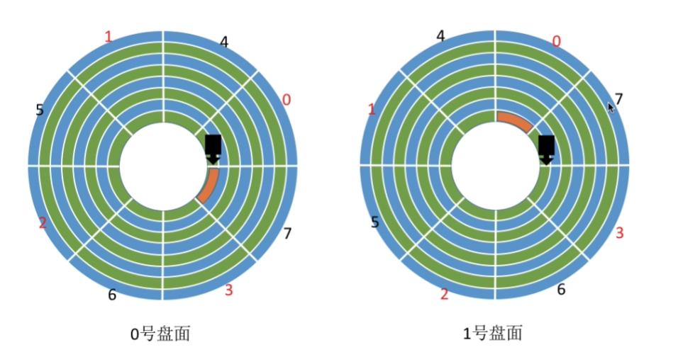

### 3.磁盘的管理

格式化的内容：

1. **低级格式化**：将磁盘的各个磁道划分为扇区。
2. 磁盘分区，每个分区都由若干个柱面组成。
3. 逻辑格式化，创建文件系统。

计算机开机时需要进行一系列初始化的工作，这些初始化工作是通过执行 **初始化程序(自举程序)** 完成的。一般存放在 **只读存储器 ROM** 中。

**ROM** 中只存放很小的**自举装入程序**，通过它来找到引导块，并将完整的自举程序读入内存。

故障的扇区被称为**坏块**。在逻辑格式化中磁盘会对坏块进行标注，如在**FAT**中标明。