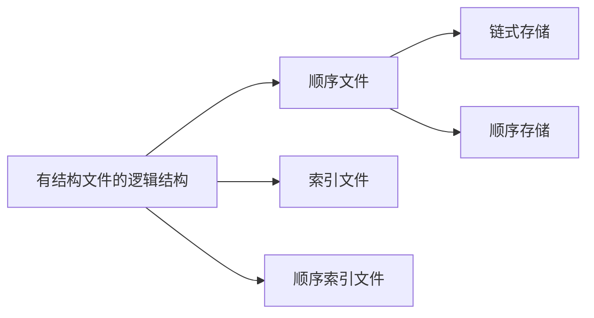
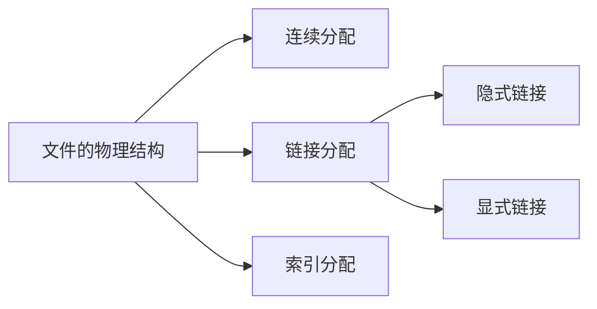

## 操作系统文件管理

### 1 . 文件的属性

##### 1. 文件的基本属性

**文件名** ： 由用户创建，主要是为了方便用户找到文件。 同一目录下不允许有重名文件

**类型** ： 指明文件的类型

**位置** ： 文件存放的路径（用户使用）， 在外存中的地址（操作系统可见）

**大小** ： 指明文件的大小

**保护信息** ： 对文件进行保护访问的控制信息

不包含**创建者**信息！

### 2. 文件的分类

文件可以分为**无结构文件**和**有结构文件**， 无结构文件数据以连续的方式存储，没有额外的结构信息，如TXT文件。 有结构文件有结构文件是具有特定格式或结构的数据集合。这种文件类型通常包含记录或字段。

### 3. 文件的逻辑结构

#### 1.顺序文件

顺序文件分为链式存储（按照日期追加）， 和顺序存储

链式存储只能挨个查找，对于顺序存储如果是可变长的记录， 就无法实现随机存取。

如果是定长记录， 使用顺序结构， 就可以快速的查找到关键字对应的记录， 但是增加和删除更加麻烦。如果是定长记录， 但使用串结构， 就无法快速寻找到某关键字对应的记录， 但是增加和删除更加方便。

#### 2. 索引文件

建立一张索引表， 使得文件可以在内存中离散的存储， 而且每个分段长度相同， 也就是可以通过表项随机访问。

但是对于小文件， 索引方式可能导致索引表项比文件本身更大， 会降低利用率。

#### 3. 索引顺序文件

相对于索引文件， 不是每个记录对应一个表项， 而是一组记录对应于一个索引表项。 查找时平均查找次数相对来说更少

为了进一步提升效率， 多级索引文件被提出，通过拆分索引表可以减少检索时间， 并且减少了增删改查的修改成本。但是索引表可能占用很多空间。

### 4. 文件目录

目录结构可以很方便的让用户实现按名存取。

#### 1. 什么是文件控制块 FCB

类似于PCB， 是对文件的管理结构， 需要存储文件名， 类型， 存储权限， 物理地址。

#### 2. 存在哪些目录结构

**单级目录**：不允许多用户文件重名

**两级目录**：分为主文件目录（MFD）和用户文件目录（UFD）但是允许用户重名。用户不能对自己的文件进行分类

**多级目录结构（树形目录结构）** ： 允许多级目录的结构，可以用多级的文件夹结构， 实现按名存取。 但是树形结构不便于文件的共享

**无环图目录结构** ： 在树形结构上增加了一些指向同一个节点的有向边， 目录结构变成了一个有向无环图， 但是对于共享文件的删除需要增加共享计数器， 当其值为0， 表示没用用户将使用该文件

### 5. 索引节点

索引节点是对FCB 结构的改进， 只存储了文件名和索引节点的指针， 索引节点再存储类型， 存储权限， 物理地址等等信息。在进行目录项检索的时候， 可以减少IO 操作的次数。

### 6. 文件的物理结构（文件分配方式）

磁盘的物理结构也会分块，磁盘块大小与内存块， 页面大小相同

#### 1. 连续分配

连续分块方式要求每个文件在磁盘上占用一组连续的块， 在存储结构中需要加上起始块号和长度

其中，物理块号 =  起始块号 + 逻辑块号（同理也会进行越界检查）， 这种访问方式支持顺序访问和随机访问

优点是读取速度快，缺点是修改文件的成本比较大， 需要在修改后也保持一段连续的物理空间， 不便于扩展。

#### 2. 链接分配

其中隐式链接需要在每个块的末尾存储下一个磁盘块的位置（除了最后一个块不需要存储）

只支持顺序访问， 不支持随机访问， 但是十分方便对文件进行扩展

显式链接会将每个块的链接存储在一张表中， 即文件分配表（**FAT** ，File Allocation Table， 表示物理块号的下一块），存储物理块号和下一项。FAT的各个表项在物理上是连续存储， 而且每一个表的长度都相同， 物理块号的这个字段是隐含的。

这种方式支持顺序访问和随机访问， 而且块号访问不需要经过磁盘IO（FAT 开机之后常驻内存）， 相对来说会快很多

如果题目中没特别声明， 默认为隐式链接分配

#### 3. 索引分配

索引分配类似分页方式， 允许文件离散地分配到各个磁盘块中，记录了逻辑块和对应物理块

支持随机访问， 对文件进行扩展和也很容易实现。 

但是索引表可能比较大， 对于超过一个磁盘块的索引表， 也有多种方式实现链接

**链接索引** ：记录文件头部物理块地址， 使用类似链表的方法链接块内部

**多级索引**： 常见考题是计算文件最大长度， 和磁盘IO次数

**混合索引** ：包含直接索引和间接索引（一级间接索引， 二级间接索引， ...）, 对于直接索引访问次数可以减少

